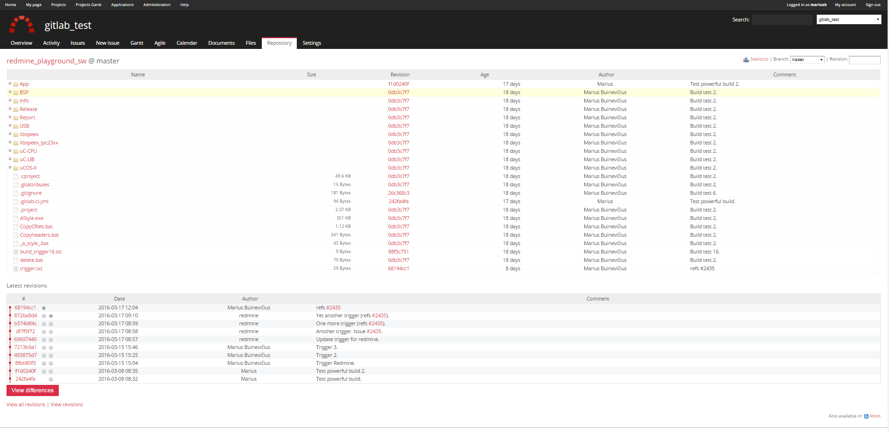
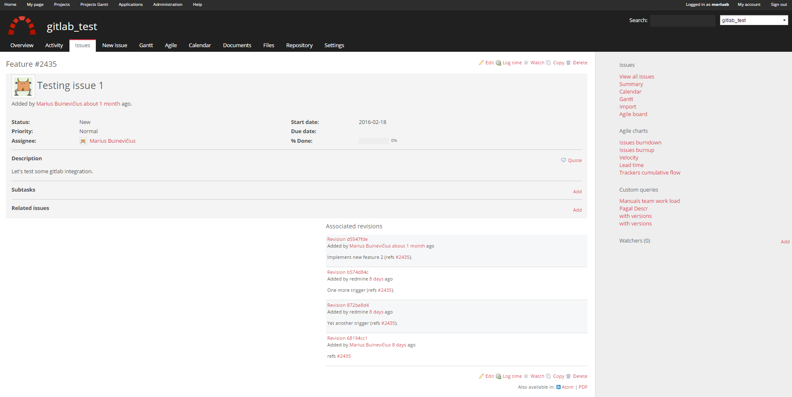
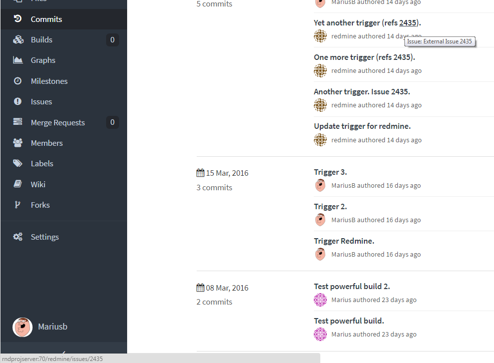
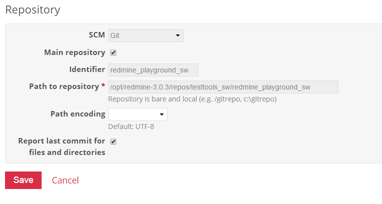
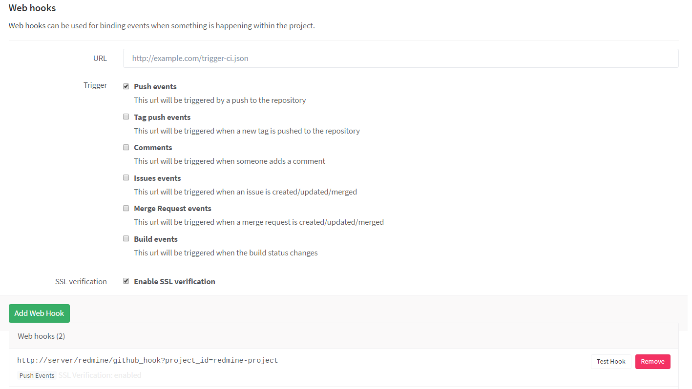
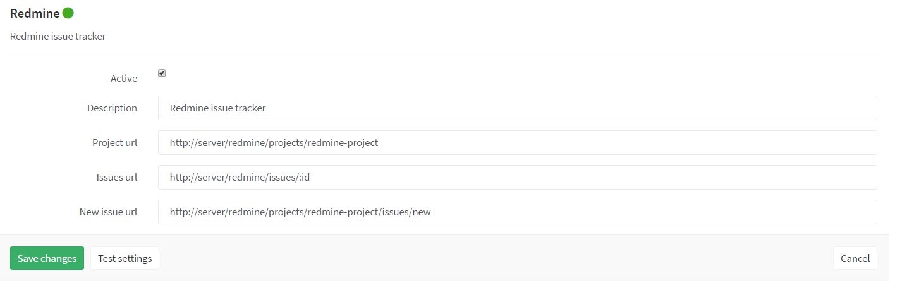

# Redmine and Gitlab integration

## Table of Contents

**[Introduction](#introduction)**

* [What is this document about?](#what-is-this-document-about)
* [What is the reason to see Gitlab information in Redmine?](#what-is-the-reason-to-see-gitlab-information-in-redmine)
* [What is the reason to see Redmine information in Gitlab?](#what-is-the-reason-to-see-redmine-information-in-gitlab)
* [Dependencies](#dependencies)

**[Gitlab in Redmine](#gitlab-in-redmine)**

* [Authentication settings](#authentication-settings)
* [Adding repository into the Redmine](#adding-repository-into-the-redmine)
* [Updating the repository automatically on changes](#updating-the-repository-automatically-on-changes)
* [Referencing issues in commit messages](#referencing-issues-in-commit-messages)

**[Redmine in Gitlab](#redmine-in-gitlab)**

* [Setting up Redmine as an external issue tracker](#setting-up-redmine-as-an-external-issue-tracker)

**[References](#references)**

# Introduction

## What is this document about?

This document describes the right way to make an integration between Gitlab and Redmine.  
  
Document is split into two main parts:  

* [Required configuration for the Gitlab integration into the Redmine](#gitlab-in-redmine)
* [Required configuration for the Redmine integration into the Gitlab](#redmine-in-gitlab)

## What is the reason to see Gitlab information in Redmine?

Integration from the Redmine point of view means that it is possible to show GIT repositories (branches, commits, tags, etc.) in Redmine, together with specific issues referenced inside commit messages.  

 
The following image illustraces the "Repository" view in Redmine project:  
 

  

   
The following image illustrates the references (associated revision) from specific commits in `Issue` view:  
 

## What is the reason to see Redmine information in Gitlab?
Integration from the Gitlab point of view means that it is possible to see direct links to the Redmine tickets referenced in commit messages.  

The following picture illustrates two things - links to the Redmine issues and a button on the left panel called `Issues` which directly forwards the user to the assigned project in Redmine:  
 

## Dependencies

A list of required dependencies for the integration to work:  

* [Gitlab installation.](https://about.gitlab.com/)
* [Redmine installation.](http://www.redmine.org/)
* [GIT on redmine server.](https://git-scm.com/)
* [Redmine Github hook plugin.](https://github.com/koppen/redmine_github_hook)

# Gitlab in Redmine

## Authentication settings

Redmine cannot directly access repositories in remote GIT server like it would do with SVN. A local copy of required repositories must be stored in Redmine server.  

In order to successfully clone and maintain the local repositories the following actions must be taken:

* A new Gitlab user must be created which has the correct rights to access the required GIT repositories.
* The owner of Redmine installation must access GIT commands.
* The owner of Redmine installation must have an SSH key generated in `/home/<usr>/.ssh` directory (`id_rsa` private and `id_rsa.pub` public keys). This can be done with the following command:  
`ssh-keygen -f home/<redmine_installation_owner>/.ssh`.
* Generated public key must be imported into the appropriate user's SSH section in Gitlab (`Profile settings > SSH Keys`).

If all these steps were completed correctly, then the Redmine installation should have the access to clone and fetch the repositories over SSH.

## Adding repository into the Redmine

Once the SSH authentication setup is complete it is now possible to add the repository into the Redmine.  
As it was mentioned before, GIT cannot work as remote repository in Redmine, it means that Redmine cannot directly access the remote repository. It must have a local mirrored repository on the file system and the installation's user can only perform `fetch` command in order to get the latest commit information.  
 
In order to have the repository in Redmine, then following actions must be taken:
  
* A new folder must be created inside Redmine installation directory: `mkdir <redmine_installation_root>/repos`.
* The required project must be cloned as a mirrored repository inside the newly created folder. For example, let's consider the project with a name `testprojects/project.git`. So the clone command should look like this:  
`git clone --mirror git@gitlabserver:testprojects/project.git <redmine_installation_root>/repos/testprojects/project`
* Now go to the required project settings in Redmine, press on the `Repositories` tab and press `New repository`.
* Select `Git` in SCM drop down list.  
* Select if it is the main repository, since there may be more than one repositories for a specific project. Only one repository can be the main repository. The main repository means, that it will appear first when `Repository` tab is accessed.
* Write some kind of descriptive identifier so it would be easy to identify what that repository actually means. It might be the same name as the actual Git repository name. It this case `Identifier` can become `project`.
* Add the path to the previously cloned repository. In this case `/<redmine_installation_root>/repos/testprojects/project`.
* Leave path encoding empty.
* Check the `Report last commit for files and directories` check box.
* Save the newly created repository.  

The final saved configuration should look like the following:  
 

## Updating the repository automatically on changes

This is a very important step to accomplish in order to see the latest changes in the `Repository` tab or in specific issue ticket. For the following configuration we will be using the same example repository `testprojects/project.git` as mentioned before. And in the Redmine consider a project named `Redmine Project` with its identifier `redmine-project`. So the project's access link would become `http://server/redmine/projects/redmine-project`. Is is assumed that this project has the repository `testprojects/project.git` added already.

In order to be able to see the latest changes in the Redmine, the following actions must be taken:  

* Go to the project's `testprojects/project.git` settings in Gitlab.
* Press `Web Hooks` on the left panel.
* Enter the URL `http://server/redmine/github_hook?project_id=<project_identifier_in_redmine>`. So in this case the URL would become `http://server/redmine/github_hook?project_id=redmine-project`.
* Select the required triggers, that would update the repository in Redmine. Usually `Push events` is only required as the update trigger.
* `SSL verification` can be left checked.
* Press `Add Web Hook` to save the configuration.

The saved configuration should look like the following:  
 
  
 
Now if everything is configured correctly, Redmine installation's users should be able to fetch updates once there are push events in the `testprojects/project.git` repository.

## Referencing issues in commit messages

As it was shown above it is possible to see `Associated revisions` in the specific Redmine issues. To have those inside the ticket view it is a must to write the special keyword in the commit messages followed by the issue number. The list of the keyword can be changed on demand. This is configured in the `Redmine->Settings->Repositories->Referencing keywords`.

The following keywords are currently configured:

* refs
* ref
* reference
* issue
* issues
* bug
* bugs
* feature
* features
* release
* update
* updates
* updated
* hotfix
* fix
* fixes
* fixed
* progress

Example commit messages:

* `Fixed issue #1234.`
* `Finished implementing feature #4567.`
* `Bug #7891 fixed.`

# Redmine in Gitlab

## Setting up Redmine as an external issue tracker

Redmine can become as an external issue tracker in Gitlab repository instead of the built-in issue tracker. Gitlab's own issue tracker may be more useful, but since other employees in the company don't use Gitlab and still want to track the status of the issues - an external issue tracker like Redmine must be used.  

For the following instructions the same project with the identifier `redmine-project` in the Redmine server will be used as discussed earlier.

In order to set up Redmine as an external issue tracker in the specific repository, the following actions should be taken:  

* Go to the project `Settings` in Gitlab.
* Click on the `Services` located at the left side panel.
* Locate and click on the service named `Redmine`.
* Check the `Active` check box.
* Write some kind of useful description for the service in the `Description` field. It will not appear anywhere though.
* For the `Project url` field enter the URL of the redmine project. In this case it would be `http://server/redmine/projects/redmine-project`.
* For the `Issue url` field enter the issue URL followed by text `:id`. In this case `http://server/redmine/issues/:id`.
* For the `New issue url` enter the URL which would access new issue creation in the specific project. In this case `http://server/redmine/projects/redmine-project/issues/new`.
* Press `Save changes`.

Now the external issue tracker should be successfully configured. Once the issue number is mentioned in a commit message, it will appear as a link to the issue in Redmine. And also the button `Issues` at the left panel will also appear as a link to the project root in the Redmine.

The following picture represents the fully done configuration for the external issue tracker in the Gitlab:  
 
  

# References 

* [Gitlab markdown tips](https://github.com/gitlabhq/gitlabhq/blob/master/doc/markdown/markdown.md)
* [Locally mirrored repositories in Redmine](https://www.redmine.org/projects/redmine/wiki/HowTo_Easily_integrate_a_(SSH_secured)_GIT_repository_into_redmine)
* [Github hook in Redmine](https://github.com/koppen/redmine_github_hook)
* [External issue tracker in Gitlab](https://github.com/gitlabhq/gitlabhq/blob/master/doc/project_services/redmine.md)
* [Generating Gitlab SSH key](http://doc.gitlab.com/ce/ssh/README.html)